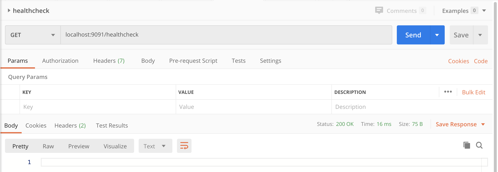

# Table booking API using Go

The purpose of this API is to provide a table-occupancy service as people arrive at the restaurant.
The API is built with Go and PostgreSQL.

## Overview

In this service, we assume that groups of diners arrive at the restaurant and have to be assigned a table. On the other hand, the tables have several seats available. So if a table has enough seats available it could accommodate a group of customers.

People requests tables in groups of 1 to 6. People in the same group want to eat on the same table. You can take any group at any table that has enough empty seats for them. If it's not possible to accommodate them, they're willing to wait until 
there's a table available for them. Once a table is available for a group that is waiting, they should eat. 

Once they get a table assigned, they will eat until they leave the restaurant, you cannot ask them to sit at another table (i.e. you cannot swap them to another table to make space for another group). In terms of fairness: groups are served in the order they arrive, but they eat opportunistically.

For example, a group of 6 is waiting for a table and there are 4 empty seats at a table for 6; if a group of 2 requests a table you may take them in the table for 6 but only if you have nowhere else to make them eat. This may mean that the group of 6 waits a long time, possibly until they become frustrated and leave the restaurant.

## API

This API must comply with the following contract:

### GET /healthcheck

Indicate the service has started up correctly and is ready to accept requests.

Responses:

* **200 OK** When the service is ready to receive requests.

### PUT /tables

Load the list of available tables in the service and remove all previous data (existing bookings and tables). This method may be called more than once during the life cycle of the service.

**Body** _required_ The list of tables to load.

**Content Type** `application/json`

Sample:

```json
[
  {
    "id": 1,
    "seats": 4
  },
  {
    "id": 2,
    "seats": 6
  }
]
```

Responses:

* **200 OK** When the list is registered correctly.
* **400 Bad Request** When there is a failure in the request format, expected headers, or the payload can't be unmarshalled.

### POST /booking

A group of people requests to perform a booking.

**Body** _required_ The group of people that wants to perform the booking

**Content Type** `application/json`

Sample:

```json
{
  "id": 1,
  "people": 4
}
```

Responses:

* **200 OK** or **202 Accepted** When the group is registered correctly
* **400 Bad Request** When there is a failure in the request format or the payload can't be unmarshalled.

### POST /bill

A group of people asks for the restaurant bill to leave.

**Body** _required_ A form with the group ID, such that `ID=X`

**Content Type** `application/x-www-form-urlencoded`

Responses:

* **200 OK** or **204 No Content** When the group is unregistered correctly.
* **404 Not Found** When the group is not to be found.
* **400 Bad Request** When there is a failure in the request format or the payload can't be unmarshalled.

### POST /locate

Given a group ID such that `ID=X`, return the table the group is eating with, or no table if they are still waiting to be seated.

**Body** _required_ A url encoded form with the group ID such that `ID=X`

**Content Type** `application/x-www-form-urlencoded`

**Accept** `application/json`

Responses:

* **200 OK** With the table as the payload when the group is assigned to a table.
* **204 No Content** When the group is waiting to be assigned to a table.
* **404 Not Found** When the group is not to be found.
* **400 Bad Request** When there is a failure in the request format or the payload can't be unmarshalled.

## Dependencies

### Go


*The Go Programming Language by The Go Authors - https://blog.golang.org/go-brand*

Golang is the main language of this application and is necessary for its development and deployment.
To install Golang all we have to do is follow their <a href="https://golang.org/dl/" target="_blank">official documentation</a>, it will only take a few moments. 

### Docker


*Docker brand - https://github.com/docker*

Docker is used to providing a container to our application and database. At the same time, it provides a quick way to deploy the API. To install Docker we go to their <a href="https://www.docker.com/get-started" target="_blank">official site</a> and select our operating system.

### Postman (Optional)


*Postman brand - https://github.com/postmanlabs*

A JSON Postman [`collection`](./postman/table-booking.postman_collection.json) is provided in the repository for the purpose of testing operations once the API is deployed, although it is not mandatory to test operations in this way. To install Postman we go to their <a href="https://www.postman.com/downloads/" target="_blank">official site</a> and select our operating system.

## Getting Started

The first step is to clone or download the repository. Once done, we open a console and browse to it.

A Makefile is provided in the repository so starting to use the API is very simple:

```bash
MBP-Dani:table-booking daniortiz$ make
Welcome to Table-booking API!
Prerequisites:
1. Golang
2. Docker
3. Unix based os
Options:
help:  Show this help.
table-booking-up:  Command to run the application.
table-booking-down:  Command to shut down the application. 
```

Once you have checked that you have Go installed and daemon Docker is running to start the service you just have to choose the right option:

```bash
MBP-Dani:table-booking daniortiz$ make table-booking-up
...
...
Creating table-booking_rest_1 ... done
Creating table-booking_db_1   ... done
Attaching to table-booking_rest_1, table-booking_db_1
rest_1  | 2020/04/11 18:46:28 Starting server...
...
...
db_1    | 2020-04-11 18:46:29.848 UTC [1] LOG:  database system is ready to accept connections
```
The first thing the operation does is to build the Go executable and then execute our [`docker-compose`](./docker-compose.yml). This docker-compose starts the Go service and a PostgreSQL database that is initialized with the [`table-booking_dump.sql`](./table-booking_dump.sql) script.

So the API is now ready to receive requests. To check that everything is correct, use operation **"/healthcheck"**.



To turn off the service we have to open a new console and execute the other command in the make file:
```bash
MBP-Dani:table-booking daniortiz$ make table-booking-down
docker-compose -f docker-compose.yml  down
Stopping table-booking_db_1   ... done
Stopping table-booking_rest_1 ... done
Removing table-booking_db_1   ... done
Removing table-booking_rest_1 ... done
Removing network table-booking_default
```
## License

All other files are covered by the MIT license, see [`LICENSE`](./LICENSE).
